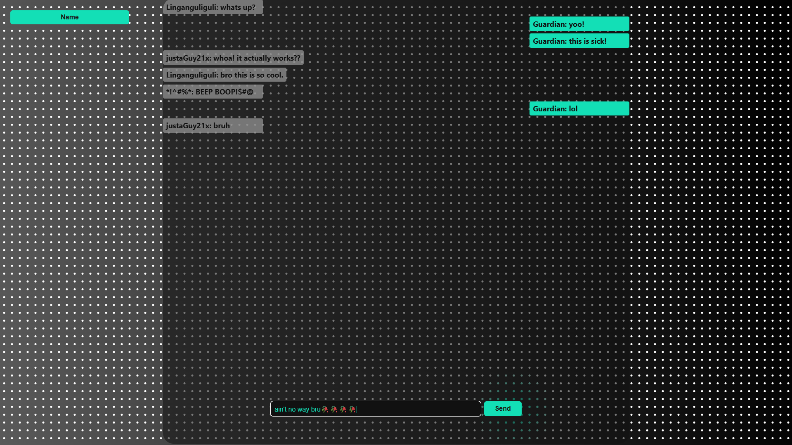
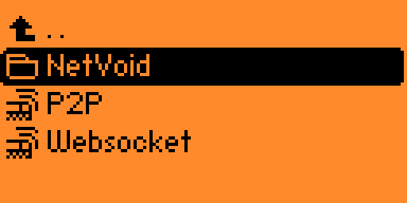
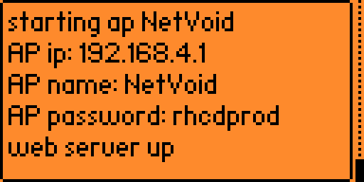
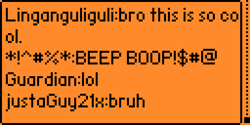

# NetVoid – Offline ESP32 Chatroom (Works on Flipper Zero)

**NetVoid** is a fully offline communication system built for ESP32 and Flipper Zero. It transforms your ESP32 into a Wi-Fi access point that hosts a local chatroom or peer-to-peer chat—no internet required. Perfect for secure, private communication in any environment.

---

## 🔧 Requirements

* Flipper Zero
* ESP32 flashed with NetVoid firmware
* **[Evil Portal app](https://github.com/bigbrodude6119/flipper-zero-evil-portal)** by **[@bigbrodude6119](https://github.com/bigbrodude6119)**
* HTML chat page (**`Websocket.html`** or **`P2P.html`**)

---

## 💬 Chat Modes

### 1. **Chatroom Mode (Recommended)**

* **Supports multiple users**
* **No pairing or codes required**
* Devices connect to the Wi-Fi and can start chatting instantly
* Ideal for group communication

### 2. **P2P Mode**

* **One-on-one encrypted chats**
* Requires exchanging pairing codes
* Less suitable for fully offline or uncoordinated setups

---

## 🚀 Setup Instructions

### 1. **Flash the ESP32**

Flash your ESP32 with **`NetVoid.iso`** to prepare it to host the chat system.

> **Note:** The **`NetVoid.iso`** has a message storage limit. To increase it, edit line 40:
> **`const size_t maxMessages = 50;`**

---

### 🔥 Alternative Flash Method (**Flash from the Flipper!**)

You can save the bootable **`.bin`** files from the **"Bootable Bins"** folder to your Flipper's SD card under:
**`SD Card/apps_data/esp_flasher/`**

Then use the **[ESP Flasher app](https://github.com/0xchocolate/flipperzero-esp-flasher)** by **[@0xchocolate](https://github.com/0xchocolate)**.
Choose **Manual Flash** and select the appropriate **`.bin`** files manually.

---

### 2. **Prepare the Flipper Zero**

* Ensure the Evil Portal app is installed. If not, get it from:
  **[Evil Portal app](https://github.com/bigbrodude6119/flipper-zero-evil-portal)** by **[@bigbrodude6119](https://github.com/bigbrodude6119)**
* Copy the provided **`Websocket.html`** or **`P2P.html`** file to your Flipper’s SD card under:
  **`SD Card/apps_data/evil_portal/html/`**

---

### 3. **Launch the Portal**

* Open the Evil Portal app on your Flipper Zero
* Use the **Set AP name** option to name your Wi-Fi access point

> **Tip:** You can also set a password by adding a semicolon **`;`** after the name.
> Format: **`"NetVoid;rhcdprod"`**

* Select the desired HTML file (**`Websocket.html`** or **`P2P.html`**)

> **Note:** The Flipper will display a randomly generated Wi-Fi password after startup.

---

### 4. **Join the Chat**

* Any device connecting to the **`NetVoid`** access point will be redirected to the chat page.
  If not automatically redirected, open the IP address shown on the Flipper screen (e.g., **`AP IP: 192.168.4.1`**)
* Users can begin chatting immediately
* The Flipper Zero displays all chat messages in real time

---

## 🌐 How It Works

* The ESP32 runs a captive portal using WebSocket for real-time messaging
* Devices connect over Wi-Fi and are served the **`chat.html`** page from the Flipper SD card
* All communication is fully local and offline
* The Flipper Zero displays chat history between all connected devices
